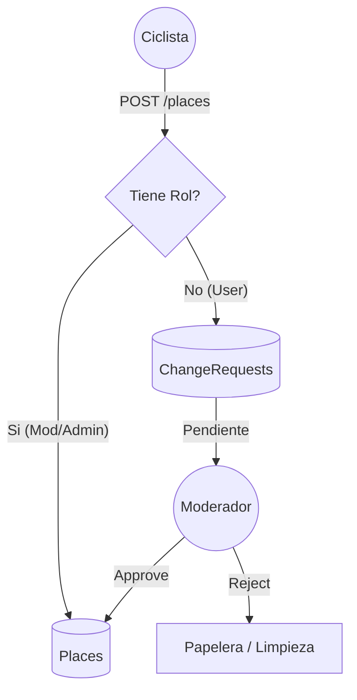

# 🚴‍♂️ Rodada Libre API


> 🇺🇸 **English**: Read this document in English [here](./README.md).

Backend RESTful diseñado para la aplicación móvil [**Rodada Libre**](https://rodadalibre.github.io/), disponible próximamente en Google Play Store. Esta API gestiona la geolocalización de servicios para ciclistas, autenticación segura y un sistema de moderación de contenido colaborativo.

## 📋 Tabla de Contenidos
- [Arquitectura y Flujo](#-arquitectura-y-flujo)
- [Tecnologías](#-tecnologías)
- [Instalación Local](#-instalación-local)
- [Seguridad y Roles](#-seguridad-y-roles)


## 🏗 Arquitectura y Flujo

El núcleo del sistema es la integridad de los datos geográficos. Para garantizar calidad sin frenar la contribución de los usuarios, implementamos un patrón de **Moderación Asíncrona (Change Request Pattern)**:


### Características Clave

Upload First Strategy: Carga de imágenes desacoplada para optimizar la experiencia de usuario en redes móviles inestables.

Soft Deletes: Prevención de pérdida de datos accidental en entidades críticas (Usuarios, Lugares, Fotos).

Role-Based Access Control (RBAC): Gestión granular de permisos mediante Spatie.

## 🛠 Tecnologías
- **Core: Laravel 12 / PHP 8.2+**

- **Base de Datos: MySQL 8.0**

- **Autenticación: JWT (tymon/jwt-auth)**

- **Autorización: RBAC (spatie/laravel-permission)**

## 💻 Instalación Local
Requisitos: PHP 8.2, Composer, MySQL.

**1.- Clonar y preparar**
```bash
git clone https://github.com/rodrigocarreonc/RodadaLibreAPI.git
cd RodadaLibreAPI
composer install
cp .env.example .env
```

**2.-Configurar Base de Datos**

Edita el archivo *.env* con tus credenciales locales (DB_DATABASE, etc).

**3.-Generar Claves**
```bash
php artisan key:generate
php artisan jwt:secret
php artisan storage:link
```
**4.-Migraciones y Seeders**

Edita el archivo *.env* y agrega las variables de entorno para cada credencial de usuario, moderador y administrador
```code
# Seed admin details
SEED_ADMIN_FIRST_NAME="admin_first_name"
SEED_ADMIN_LAST_NAME="admin_last_name"
SEED_ADMIN_EMAIL="admin@example.com"
SEED_ADMIN_PASSWORD="admin123"

SEED_MODERATOR_FIRST_NAME="moderator_first_name"
SEED_MODERATOR_LAST_NAME="moderator_last_name"
SEED_MODERATOR_EMAIL="mod@example.com"
SEED_MODERATOR_PASSWORD="mod123"

SEED_USER_FIRST_NAME="user_first_name"
SEED_USER_LAST_NAME="user_last_name"
SEED_USER_EMAIL="user@example.com"
SEED_USER_PASSWORD="user123"
```
Y corre las migraciones y seeders
```bash
php artisan migrate --seed
# Esto crea puntos de interes iniciales y los roles de un usuario, moderador y administrador
```

## 🛡 Seguridad y Roles
El sistema utiliza RBAC (Role-Based Access Control).

| Rol          | Permisos                                                     |
|--------------|--------------------------------------------------------------|
| User         | Ver mapa, enviar contribuciones (revisadas por moderacion).  |
| Moderator    | Ver mapa, Crear/Editar lugares directo, Aprobar solicitudes  |
| Admin        | Todo lo anterior + Gestionar usuarios y asignar roles.       |

## 📄 Licencia
Propiedad de José Rodrigo Carreón Cardona. Todos los derechos reservados.