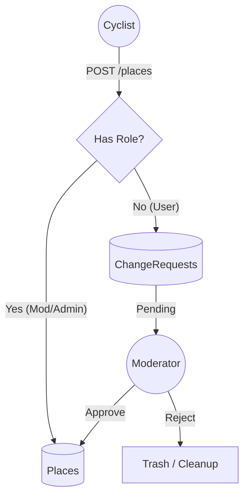

# 🚴‍♂️ Rodada Libre API


> 🇪🇸 **Español**: Lee este documento en español [aquí](./README.es.md).

RESTful Backend designed for the [**Rodada Libre**](https://rodadalibre.github.io/), mobile app, soon available on the Google Play Store. This API handles geospatial services for urban cyclists, secure authentication, and a collaborative content moderation system.

## 📋 Table of Contents
- [Architecture & Workflow](#-architecture--workflow)
- [Tech Stack](#-tech-stack)
- [Local Installation](#-local-installation)
- [Security & Roles](#-security--roles)


## 🏗 Architecture & Workflow

The core of the system ensures data integrity for geospatial points. To guarantee quality without hindering user contributions, we implemented an **Asynchronous Moderation Pattern (Change Request Pattern)**:


### Key Features

**Upload First Strategy:** Decoupled image uploading to optimize UX on unstable mobile networks.

**Soft Deletes:** Prevention of accidental data loss for critical entities (Users, Places, Photos).

**Role-Based Access Control (RBAC):** Granular permission management using Spatie.

## 🛠 Tech Stack
- **Core: Laravel 12 / PHP 8.2+**

- **Database: MySQL 8.0**

- **Authentication: JWT (tymon/jwt-auth)**

- **Authorization RBAC: (spatie/laravel-permission)**

## 💻 Local Installation
Requirements: PHP 8.2, Composer, MySQL.

**1.- Clone and prepare**
```bash
git clone https://github.com/rodrigocarreonc/RodadaLibreAPI.git
cd RodadaLibreAPI
composer install
cp .env.example .env
```

**2.-Database Configuration**

Edit *.env* file with your local credentials (DB_DATABASE, etc).

**3.-Generate Keys**
```bash
php artisan key:generate
php artisan jwt:secret
php artisan storage:link
```
**4.-Migrations y Seeders**

Edit *.env* and add the environment variables for each user, moderator, and administrator credential
```code
# Seed admin details
SEED_ADMIN_FIRST_NAME="admin_first_name"
SEED_ADMIN_LAST_NAME="admin_last_name"
SEED_ADMIN_EMAIL="admin@example.com"
SEED_ADMIN_PASSWORD="admin123"

SEED_MODERATOR_FIRST_NAME="moderator_first_name"
SEED_MODERATOR_LAST_NAME="moderator_last_name"
SEED_MODERATOR_EMAIL="mod@example.com"
SEED_MODERATOR_PASSWORD="mod123"

SEED_USER_FIRST_NAME="user_first_name"
SEED_USER_LAST_NAME="user_last_name"
SEED_USER_EMAIL="user@example.com"
SEED_USER_PASSWORD="user123"
```
Y run migration and seeders
```bash
php artisan migrate --seed
# This creates initial places and the roles of a user, moderator, and administrator.
```

## 🛡 Security & Roles
The system uses RBAC (Role-Based Access Control).

| Role          | Permissions                                                     |
|--------------|--------------------------------------------------------------|
| User         | View map, Suggest places (goes to moderation queue). |
| Moderator    | View map, Create/Edit places directly, Approve requests.  |
| Admin        | All of the above + Manage users and assign roles.       |

## 📄 License
Proprietary software owned by José Rodrigo Carreón Cardona. All rights reserved.